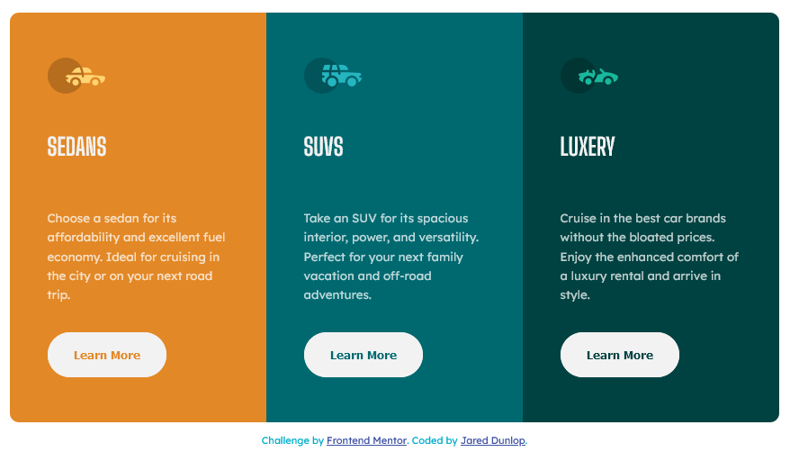

# Frontend Mentor - 3-column preview card component solution

This is a solution to the [3-column preview card component challenge on Frontend Mentor](https://www.frontendmentor.io/challenges/3column-preview-card-component-pH92eAR2-). Frontend Mentor challenges help you improve your coding skills by building realistic projects. 

## Table of contents

- [Overview](#overview)
  - [The challenge](#the-challenge)
  - [Screenshot](#screenshot)
  - [Links](#links)
- [My process](#my-process)
  - [Built with](#built-with)
  - [What I learned](#what-i-learned)
  - [Continued development](#continued-development)
  - [Useful resources](#useful-resources)
- [Author](#author)

## Overview

### The challenge

Users should be able to:

- View the optimal layout depending on their device's screen size
- See hover states for interactive elements

### Screenshot

### Links

- Solution URL: [Source code on Github](https://github.com/intherightdirection/3-column-preview-card-component)
- Live Site URL: [Live site on Github](https://intherightdirection.github.io/3-column-preview-card-component/)

## My process

### Built with

- Semantic HTML5 markup
- CSS custom properties
- Flexbox
- CSS Grid
- Mobile-first workflow

### What I learned

I learned grid is not as easy as people make it look. I like it though.

### Continued development

As far as CSS goes, I want to continue focus on grid layouts. I chose this easier project to try it out and get my feet wet.

### Useful resources

- [Free: Learn CSS GRID with Wes Bos](https://cssgrid.io/) - This ended up being my starting point in learning css grid. I am still not finished the course because I thought I'd get more from it putting some of the earlier most basic material to use and getting practice until I am ready for more.

## Author

- Website - [Github: Jared Dunlop](https://github.com/)
- Frontend Mentor - [@intherightdirection](https://www.frontendmentor.io/profile/intherightdirection)
